# Trabalho final - Equipe 7

**UNIVERSIDADE FEDERAL DA BAHIA**

**COMPONENTE:** ACCS: Oficina de Projetos em Inteligência Artificial

**Professores:** Barbara Coelho Neves, Daniela Claro e Ricardo Coutinho

**Membros:**
- Ana Clara Almeida Moreira - Contribuição: Pré-processamento
- Daniel Oliveira Santiago da Silva - Contribuição: Pré-processamento
- Emily Santos Sancho - Contribuição: Gestão de projeto
- Felipe Carvalho Goes - Contribuição: Aprendizado de máquina e Pré-processamento
- João Vitor Moreira de Jesus - Contribuição: Pré-processamento

# Relatório de Pré-Processamento

O primeiro passo do nosso pré-processamento consistiu em estudar o dicionário, pois o grande número de instâncias e alta dimensionalidade nos impossibilitou de fazer qualquer análise direta sobre os dados. A partir da análise do dicionário, verificamos as informações de cada coluna, possibilitando definir quais delas seriam necessárias manter e quais poderíamos remover para que pudéssemos ter uma base alinhada aos nossos objetivos.

As informações que analisamos no dicionário, nos possibilitou chegar às seguintes conclusões:
- As variáveis com dados sobre números de unidades hospitalares e números de telefones dessas unidades foram descartadas por serem informações irrelevantes para a análise.
- Definimos a variável CLASSI_FIN como alvo para os nossos modelos de predição por conter dados de classificação final para a investigação de suspeita de doença. Todas as instâncias sem classificação foram removidas.
- As variáveis com dados de data de investigação, datas de exames, data de internação e coletas de isolamento do paciente foram descartadas, considerando que haviam outras variáveis que continham os resultados desses exames e coletas, sendo essas informações úteis para o modelo que queríamos atingir.
- As variáveis de sintomas foram mantidas e decidimos descartar as variáveis que continham dados de acompanhamento do paciente após o diagnóstico por considerarmos que não seriam informações relevantes para a etapa do projeto.

Quando contabilizamos a quantidade de colunas que havia no arquivo da base e comparamos com a quantidade de variáveis com informações no dicionário, percebemos que havia uma diferença de 63 variáveis a mais no arquivo do que havia sido informado no dicionário. Decidimos remover essas variáveis excedentes por considerarmos impróprio trabalhar com dados dos quais não teríamos informações e consequentemente não conseguiríamos analisá-los.

Com a remoção de todas as colunas que consideramos descartáveis, nossa base de dados ficou com apenas 40 colunas e ao verificarmos a nulidade desse novo conjunto, descobrimos que cada coluna de sintomas estavam com 79.000 instâncias nulas e cada uma das colunas com informações sobre exames excediam mais de 400.000 instâncias com nulidade. Para as variáveis de sintomas consideramos preencher a nulidade com o valor da moda, considerando também que a quantidade de valores nulos em cada uma era inferior a metade do número total de instâncias e para as outras colunas, consideramos que seria mais viável fazer a imputação desses dados ausentes com o KNN Imputer, porém por problemas de desfalques na equipe e por falta de poder computacional, decidimos descartar essa ideia e trabalhar apenas com a substituição de valores ausentes por valores de moda.

Decidimos fazer testes com quatro variações da base pré-processada e quatro variações da base pré-processada na forma balanceada para rodar nos algoritmos de aprendizado de máquina e definirmos qual apresenta a melhor estratégia de pré-processamento em relação ao preenchimento da nulidade: 
- Na primeira abordagem, removemos as 79.000 instâncias nulas das variáveis de sintomas e removemos os atributos com informações de exames,  HOSPITALIZ e SOROTIPO 
- Na segunda abordagem removemos os valores nulos das variáveis de sintomas e preenchemos a nulidade das variáveis HOSPITALIZ, SOROTIPO e das variáveis com informações de exames com os valores de moda.
- Na terceira abordagem, preenchemos a nulidade de todas as variáveis com os valores da moda 
- Na quarta abordagem, preenchemos apenas a nulidade das variáveis de sintomas e removemos os atributos HOSPITALIZ, SOROTIPO e as variáveis com informações de exames
- Para as variações da base na forma balanceada, correspondeu manter apenas duas classificações nos modelo de predição: Dengue ou não Dengue. Isso foi atingido ao converter as classes 1.0, 2.0, 5.0 e 8.0 para 0.0 - Não dengue e as classes 10.0, 11.0 e 12.0 para 1.0 - Dengue.

Utilizamos as bibliotecas Pandas, Matplotlib e Seaborn para criar gráficos de correlações com a coluna alvo e percebemos que haviam altas correlações positivas entre essa coluna e as colunas PLAQ_MENOR, LACO_N, HEMARTURA e PETEQUIAS e correlações negativas com as colunas EPISTAXE e PLASMATICO, porém, só quando estávamos em uma etapa mais avançada do pré processamento, percebemos que na verdade todas essas colunas tinham altas correlações com o alvo por terem poucos dados não nulos, o que poderia significar que os índices de alta correlação dessas variáveis não eram de fato confiáveis e ao gerar gráfico boxplot, percebemos que os dados da base estavam muito concentrados e por conta disso havia poucos valores outliers 

Considerando que a maioria das colunas da nossa base eram variáveis qualitativas nominais e que por isso havia a necessidade de fazer o tratamento desses dados propriamente para evitar resultados equivocados dos testes nos modelos de predição, decidimos codifica-los com o codificador LabelEncoder para que os dados do tipo float fossem transformados em números inteiros, porém, essa transformação foi apenas eficiente para as variáveis de sintomas que tinham apenas duas categorias e assim esses números se tornavam categorias binárias, mas para as demais variáveis que continham mais de duas categorias, houve a necessidade de utilizar o codificador One-Hot Encoder para transformá-las de forma que cada coluna se divide-se em espaços vetoriais contendo apenas categorias binárias e não induzisse os modelos de predição a interpretarem esses valores como ordinais.  


## Testes das variações das bases pré-processadas nos modelos de predição

### Condições de teste

Os testes foram feitos com a base reduzida para 100.000 istâncias devido tempo de execução e 50 épocas para MLP. Os valores de acurácia dizem respeito à acurácia do conjunto de teste. O treinamento e avaliação ocorreu com base no train-test-split sobre uma proporção de 70-30 e os modelos foram definidos com os hiperparâmetros fixados pela professora.

### Resultados

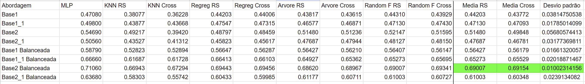

Legenda:
- RS = Random Split - ou seja, método houldout usando test-train-split do SkLearn
- Cross = K-Fold Cross Validation - no caso k=5


#### Variação escolhida


Shape: (549797, 54)

Info():

```
RangeIndex: 549797 entries, 0 to 549796
Data columns (total 54 columns):
 #   Column          Non-Null Count   Dtype  
---  ------          --------------   -----  
 0   FEBRE           549797 non-null  int64  
 1   MIALGIA         549797 non-null  int64  
 2   CEFALEIA        549797 non-null  int64  
 3   EXANTEMA        549797 non-null  int64  
 4   VOMITO          549797 non-null  int64  
 5   NAUSEA          549797 non-null  int64  
 6   DOR_COSTAS      549797 non-null  int64  
 7   CONJUNTVIT      549797 non-null  int64  
 8   ARTRITE         549797 non-null  int64  
 9   ARTRALGIA       549797 non-null  int64  
 10  PETEQUIA_N      549797 non-null  int64  
 11  LEUCOPENIA      549797 non-null  int64  
 12  LACO            549797 non-null  int64  
 13  DOR_RETRO       549797 non-null  int64  
 14  DIABETES        549797 non-null  int64  
 15  HEMATOLOG       549797 non-null  int64  
 16  HEPATOPAT       549797 non-null  int64  
 17  RENAL           549797 non-null  int64  
 18  HIPERTENSA      549797 non-null  int64  
 19  ACIDO_PEPT      549797 non-null  int64  
 20  AUTO_IMUNE      549797 non-null  int64  
 21  CLASSI_FIN      549797 non-null  float64
 22  HOSPITALIZ      549797 non-null  int64  
 23  RES_CHIKS1_1.0  549797 non-null  float64
 24  RES_CHIKS1_2.0  549797 non-null  float64
 25  RES_CHIKS1_3.0  549797 non-null  float64
 26  RES_CHIKS2_1.0  549797 non-null  float64
 27  RES_CHIKS2_2.0  549797 non-null  float64
 28  RES_CHIKS2_3.0  549797 non-null  float64
 29  RESUL_PRNT_1.0  549797 non-null  float64
 30  RESUL_PRNT_2.0  549797 non-null  float64
 31  RESUL_PRNT_3.0  549797 non-null  float64
 32  RESUL_SORO_1.0  549797 non-null  float64
 33  RESUL_SORO_2.0  549797 non-null  float64
 34  RESUL_SORO_3.0  549797 non-null  float64
 35  RESUL_NS1_1.0   549797 non-null  float64
 36  RESUL_NS1_2.0   549797 non-null  float64
 37  RESUL_NS1_3.0   549797 non-null  float64
 38  RESUL_VI_N_1.0  549797 non-null  float64
 39  RESUL_VI_N_2.0  549797 non-null  float64
 40  RESUL_VI_N_3.0  549797 non-null  float64
 41  RESUL_PCR__1.0  549797 non-null  float64
 42  RESUL_PCR__2.0  549797 non-null  float64
 43  RESUL_PCR__3.0  549797 non-null  float64
 44  HISTOPA_N_1.0   549797 non-null  float64
 45  HISTOPA_N_2.0   549797 non-null  float64
 46  HISTOPA_N_3.0   549797 non-null  float64
 47  IMUNOH_N_1.0    549797 non-null  float64
 48  IMUNOH_N_2.0    549797 non-null  float64
 49  IMUNOH_N_3.0    549797 non-null  float64
 50  SOROTIPO_1.0    549797 non-null  float64
 51  SOROTIPO_2.0    549797 non-null  float64
 52  SOROTIPO_3.0    549797 non-null  float64
 53  SOROTIPO_4.0    549797 non-null  float64
dtypes: float64(32), int64(22)
```
Nunique():
```
FEBRE             2
MIALGIA           2
CEFALEIA          2
EXANTEMA          2
VOMITO            2
NAUSEA            2
DOR_COSTAS        2
CONJUNTVIT        2
ARTRITE           2
ARTRALGIA         2
PETEQUIA_N        2
LEUCOPENIA        2
LACO              2
DOR_RETRO         2
DIABETES          2
HEMATOLOG         2
HEPATOPAT         2
RENAL             2
HIPERTENSA        2
ACIDO_PEPT        2
AUTO_IMUNE        2
CLASSI_FIN        2
HOSPITALIZ        2
RES_CHIKS1_1.0    2
RES_CHIKS1_2.0    2
RES_CHIKS1_3.0    2
RES_CHIKS2_1.0    2
RES_CHIKS2_2.0    2
RES_CHIKS2_3.0    2
RESUL_PRNT_1.0    2
RESUL_PRNT_2.0    2
RESUL_PRNT_3.0    2
RESUL_SORO_1.0    2
RESUL_SORO_2.0    2
RESUL_SORO_3.0    2
RESUL_NS1_1.0     2
RESUL_NS1_2.0     2
RESUL_NS1_3.0     2
RESUL_VI_N_1.0    2
RESUL_VI_N_2.0    2
RESUL_VI_N_3.0    2
RESUL_PCR__1.0    2
RESUL_PCR__2.0    2
RESUL_PCR__3.0    2
HISTOPA_N_1.0     2
HISTOPA_N_2.0     2
HISTOPA_N_3.0     2
IMUNOH_N_1.0      2
IMUNOH_N_2.0      2
IMUNOH_N_3.0      2
SOROTIPO_1.0      2
SOROTIPO_2.0      2
SOROTIPO_3.0      2
SOROTIPO_4.0      2
```
Balanceamento:
```
CLASSI_FIN
0.0    328645
1.0    221152
```

# Relatório de Aprendizado de Máquina - Análise de resultados

O presente relatório tem por objetivo analisar os resultados do fine tuning de hiper parâmetros para os 5 algoritmos e modelos de aprendizado de máquina propostos pela disciplina. Tais são Multi-layer Perceptron (MLP), K-Nearest Neighbors (KNN), Regressão Logística, Árvore de Decisão e Random Forest. A MLP foi implementada em Python usando a API Keras sobre a biblioteca Tensorflow e os demais algoritmos foram implementados em Python usando a biblioteca Scikit-Learn. O modelo de pré-processamento escolhido foi o modelo 2 balanceado que apresentou melhor performance sobre os algoritmos em formato de controle (hiper parâmetros definidos pelos professores) conforme descrito no relatório de pré-processamento. 

Os testes foram realizados variando um hiper parâmetro por vez e serão descritos, para cada algoritmo, nas secções subsequentes. As variações foram pensadas a partir do entendimento do funcionamento dos algoritmos e conhecimento sobre as características da base de dados.

A acurácia sobre o conjunto de teste foi utilizada como métrica principal de avaliação e o treinamento e avaliação ocorreu com base no train-test-split sobre uma proporção de 70-30. O train-test-split foi usado em vez do cross validation devido a limitações de poder computacional para executar os modelos, dado o grande número de instâncias contidas na base de dados.

Assim, nas tabelas contidas abaixo, lê-se por acurácia a acurácia obtida sobre o conjunto de teste em uma validação houldout (train-test-split) com proporção 70-30 entre conjunto de treinamento e conjunto de teste.

## Multi-layer Perceptron (MLP)

Conforme visto no relatório de pré-processamento, o pré-processamento reduziu o problema a um classificador binário para a dengue. Nesse contexto, foi escolhida a função de loss binary-crossentropy por ser matematicamente a função mais indicada para problemas de maximização de semelhança. Tal função exige que a output layer seja mantida com a função de ativação sigmoide para funcionar corretamente. Assim, durante os testes foram mantidas fixas a função de loss e a função de ativação da última camada. 

O fine tuning de hiper parâmetros para a MLP consistiu em variar a arquitetura do modelo em termos da quantidade de camadas e quantidade de neurônios por camada, variar a função de ativação de camadas intermediárias, a quantidade de épocas e alterar a taxa de aprendizado (loss weights).

A ordem de testes consistiu na seguinte:
1. Compor distintos arranjos arquiteturais variando a quantidade de camadas e a quantidade de neurônios por camada
2. Variar a quantidade de épocas da arquitetura com melhor desempenho observado
3. Testar distintas funções de ativação para camadas intermediárias na arquitetura com melhor desempenho observado
4. Variar a taxa de aprendizado da arquitetura com melhor desempenho observado

#### Resultados

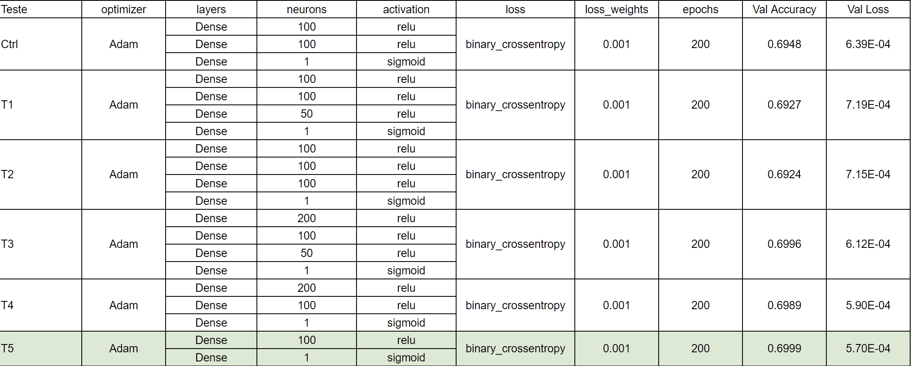

Dos testes realizados, observa-se que a arquitetura [100, relu; 1, sigmoid] retornou melhor desempenho relativo. Mantendo essa arquitetura foi variada a quantidade de épocas. O treinamento mostrou que 200 é uma quantidade muito grande de iterações, o modelo estabilizou seu aprendizado com muito menos épocas. Logo, foram testados valores menores para o total de épocas.

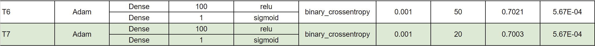

Foi escolhido o valor de 20 épocas em vez de 50, pois a diferença de acurácia não justifica a diferença em custo computacional para treinamento dos modelos comparados.

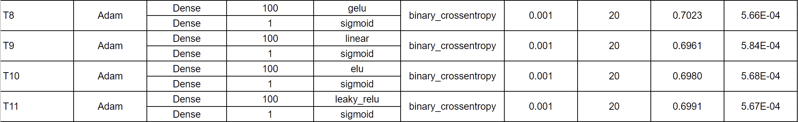

De todos os arranjos de função de ativação testados, decidimos manter a configuração [100, x; 1, sigmoide] com função de ativação relu, pois a diferença insignificante de performance em relação ao gelu não justifica a substituição de uma função de ativação solida no treinamento de MLPs.

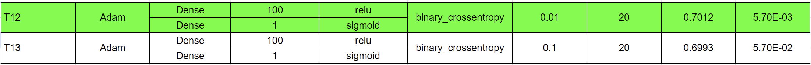

Melhor arranjo: [optimizer=Adam layers=[100, relu; 1, sigmoid] loss=binary_crossentropy loss_weights=0.01 epochs=20]
		

### K-Nearest Neighbors (KNN)

Para o KNN foram selecionados dois hiper parâmetros fundamentais, a métrica do cálculo de distância e o número de vizinhos considerados. A forma de medir distância é a forma do algoritmo de medir similaridade entre instâncias e o número de vizinhos implica em quantas instâncias vizinhas serão selecionadas para concluir a classe pela moda tendo relação com o nível de agregação dos casos. Em todos os casos de teste os pesos foram mantidos uniformes por definição dos professores que desejam a implementação do KNN e não do DWNN.

As métricas de distância escolhidas para teste foram a distância de Manhattan, Hassanat e Hamming. A distância de Manhattan foi escolhida por ser uma métrica amplamente utilizada e recomendada para dados categóricos. A distância de Hassanat foi selecionada pela influência do artigo ["Effects of Distance Measure Choice on KNN Classifier Performance - A Review"](https://arxiv.org/pdf/1708.04321) que avaliando 56 métricas de distância sobre 28 datasets de classificação concluiu que a distância de Hassanat retornava a melhor performance. Por fim, a distância de Hamming foi escolhida por ser muito utilizada com dados categóricos, marcando uma comparação direta entre duas cadeias de dígitos.

A ordem de testes consistiu em variar a métrica mantendo o número de vizinhos conforme e controle e, definida a métrica com melhor resultado, variar o número de vizinhos.

#### Resultados


Devido a restrições no poder computacional, não foi possível testar todas as métricas inicialmente planejadas. As duas métricas sem resultado foram deixadas cada qual em execução por mais de 7h, porém não concluíram.

O GridSearchCV foi utilizado para codificar as combinações de possíveis casos de teste. Variamos n_neighbors entre os valores [5, 2, 10, 50] mantendo a métrica como euclidean e os pesos uniformes. Também devido a limitações de poder computacional o dataset foi reduzido a 100.000 instâncias (como consequência, uma queda de performance no caso base da etapa anterior pode ser observada).


Melhor arranjo: [n_neighbors=50 weights=uniform metric=euclidean]

### Regressão Logística

Nos testes com o algoritmo de regressão logística, os hiper parâmetros alvo foram o solver, a penalização, o C (parâmetro que dita a força da regularização feita sobre os dados de entrada) e o máximo de iterações (max-iter).

Os solvers escolhidos para teste foram newton-cholesky, sag e liblinear. O solver newton-cholesky foi escolhido por recomendação da própria documentação do Scikit-Learn sobre o classificador de Regressão logística que indica o uso desse solver em bases que apresentam atributos categóricos one-hot encoded com valores de rara aparição, caso frequente na base em questão. Sag foi escolhido por ser otimizado para grandes datasets e o liblinear por ser bom para datasets de muitas dimensões, o que caracteriza o caso do dataset balanceado 2 que apresenta 53 atributos.

A ordem de testes consistiu em variar o solver mantendo os demais hiper parâmetros conforme e controle e, dado o solver com melhor resultado, variar os demais um a um tendo como solver o de melhor desempenho.

#### Resultados

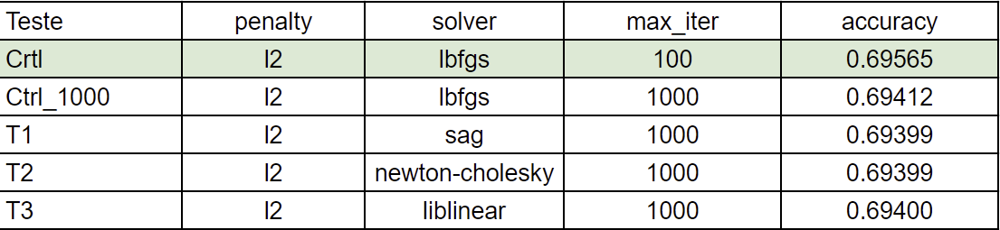

O GridSearchCV foi utilizado para codificar as combinações de possíveis casos de teste. Mantemos o solver como lbfgs conforme os testes anteriores, variamos o parâmetro Max iter entre os valores [100, 200, 500, 1000, 5000] e o parâmetro C entre os valores [0.2, 0.5, 0.7, 1.0]. Como o lbfgs aceita apenas penalty l2, variações desse hiper parâmetro não foram exploradas.

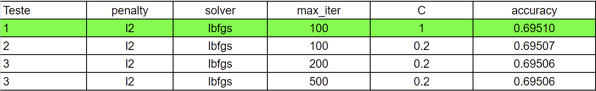

Melhor arranjo: [penalty=l2 solver=lbfgs max_iter=100 C=1.0]

### Árvore de Decisão

Como a maior desvantagem das árvores de decisão é a susceptibilidade ao overfitting para bases com grande número de instâncias e atributos, como o caso presente, o foco dos testes foi combinar variações de max-depth e min-samples-leaf para que o algoritmo não de foco demasiado às características do conjunto de treinamento, afetando a sua capacidade de generalização e, com isso, a sua acurácia nos casos de teste. A troca do critério de avaliação dos atributos de entropia para gini e log-loss (cross-entropy) também foi explorada.

A ordem de execução dos testes consistiu em primeiro variar o critério e então os demais hiper parâmetros usando o melhor critério observado como padrão.

#### Resultados

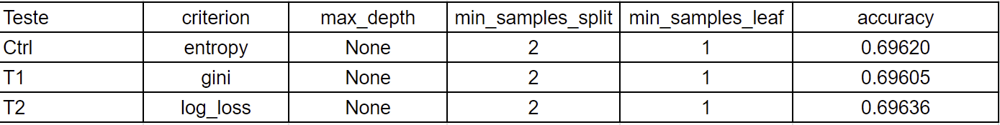

Dos testes o critério gini foi descartado e, apesar do log-loss apresentar melhor desempenho, os testes seguintes consideram também o critério entropy, pois a diferença de acurácia foi muito pequena e ele é por muito o critério mais utilizado em árvores de decisão.

O GridSearchCV foi utilizado para codificar as combinações de possíveis casos de teste. Variamos o parâmetro min_samples_leaf entre os valores [1, 5, 10, 50, 100] e o parâmetro max_depth entre os valores [None, 50, 100, 500], além de considerar 2 critérios ['entropy', 'log_loss'].

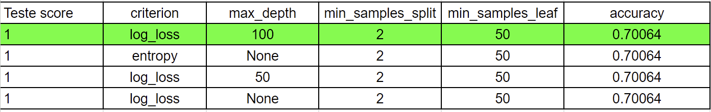

Melhor arranjo: [criterion=log_loss max_depth=100 min_samples_split=2 min_samples_leaf=50]


### Random Forest

Diferentemente da árvore de decisão, a random forest é estruturada de modo a minimizar o overfitting com o conjunto de treinamento e assim o foco do teste consistiu na variação do número de árvores da floresta para captar em diferentes níveis os atributos do dataset. A troca da função para cálculo do max-features de raiz quadrada para log2 e números inteiros definidos também foi explorada, assim como a troca do critério para gini e log-loss.

A ordem de execução dos testes consistiu em primeiro variar o critério, com o melhor critério variar o max-fetures e por fim variar o total de árvores na floresta.

#### Resultados

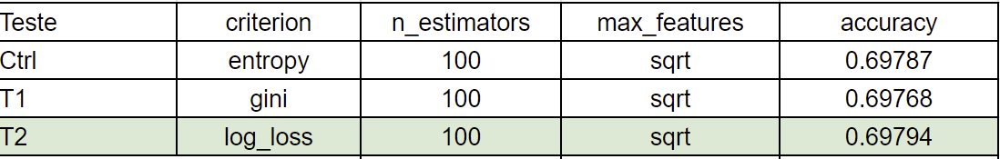

O log-loss se mostrou o critério com melhor desempenho, sendo mantido. 

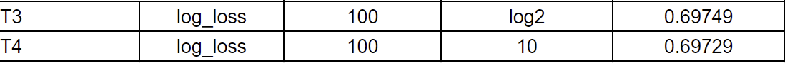

Observando os resultados, o cálculo de max features por sqrt ainda se manteve com acurácia superior às variações testadas.

O GridSearchCV foi utilizado para codificar as combinações de possíveis casos de teste. Variamos n_estimators entre os valores [100, 500, 1000, 2000] mantendo o critério como log-loss e max features como sqrt conforme validado anteriormente. Também devido a limitações de poder computacional o dataset foi reduzido a 100.000 instâncias (como consequência, uma queda de performance no caso base da etapa anterior pode ser observada).

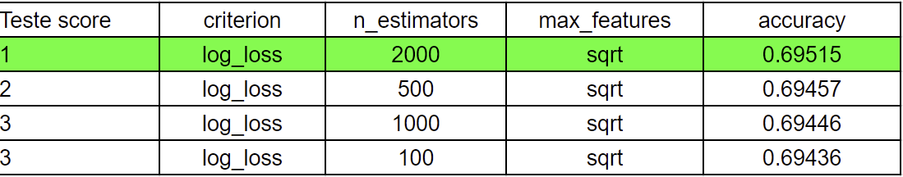

Melhor arranjo: [criterion=log_loss n_estimators=2000 max_features=sqrt]

## Conclusão do relatório de Aprendizado de Máquina

Pelos resultados pode-se observar que apesar dos extensivos testes, pouca acurácia foi ganha com a variação dos hiper parâmetros, levando a conclusão de que o maior potencial para ganho de performance está na melhora do pré-processamento. Isso, contudo, só pode ser feito em trabalho conjunto com a SESAB, pois há dados faltantes e incoerentes na base original que tiveram que ser supostos ou removidos, prejudicando a acurácia dos dados na representação de cenários positivos e negativos.
